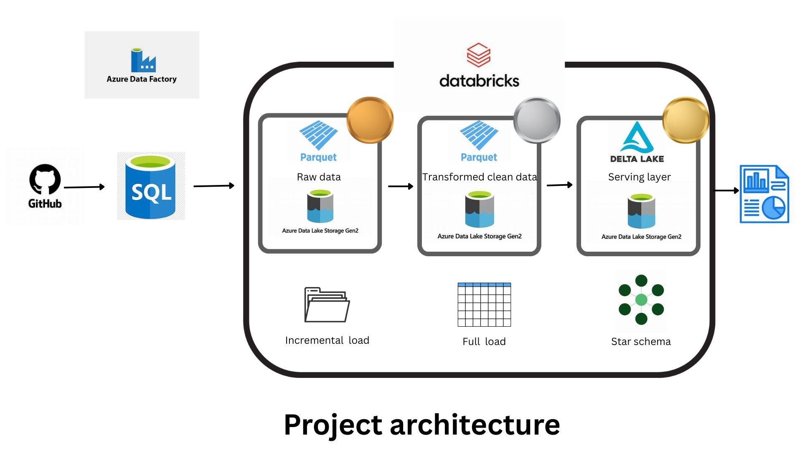
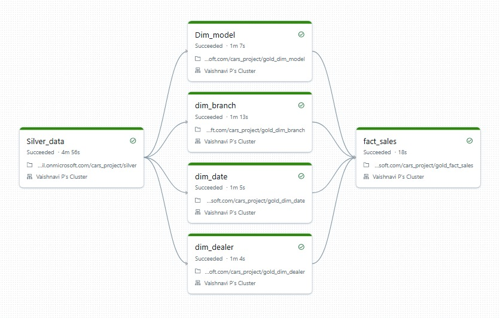
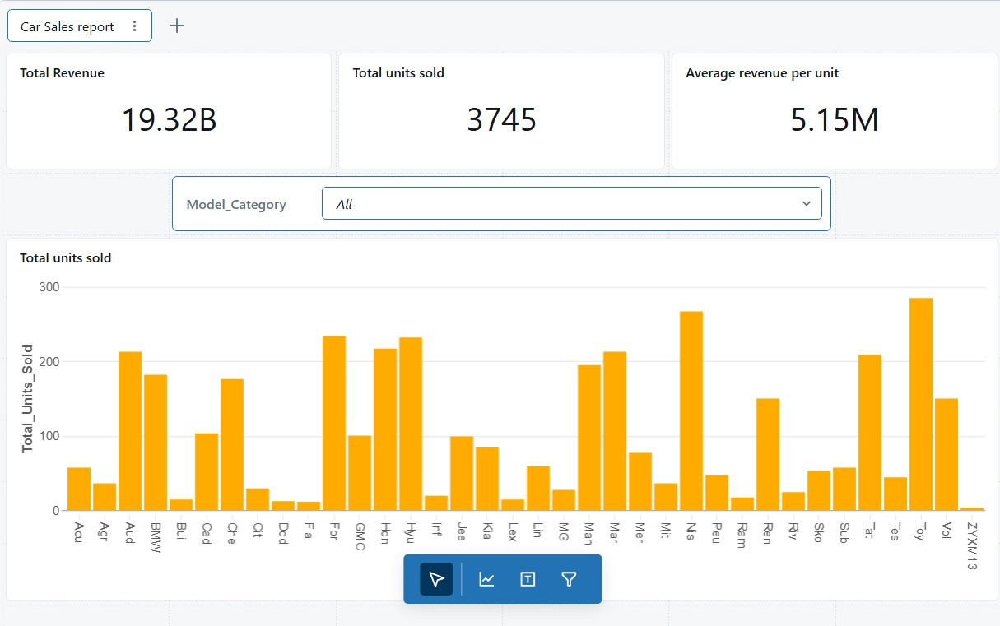

# Cars_Sales_Data_Engineering_Project
This is an end-to-end azure data engineering project. 

The data is fetched incrementally from a SQL server into the ADLS Gen 2. The storage follows medallion architecture. The bronze data is cleaned and transformed and fully loaded into the silver layer. These layers hold parquet files. The table in the silver layer is then broken down into a dimensional model with star schema with SCD type 1. Databricks with unity catalog is leveraged for the transformation and the movement of data in the medallian architecture with ADLS as the external storage. Workflow is used for orchestration. 

The data is served from he gold layer and a basic report of Car sales is built.

